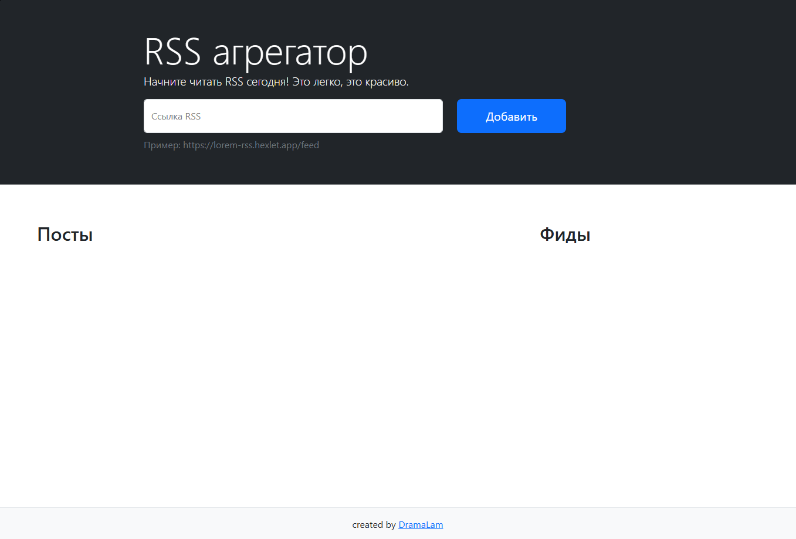

### Hexlet tests and linter status:

[](https://github.com/DramaLam/frontend-project-11/actions)
[](https://github.com/DramaLam/frontend-project-11/actions/workflows/check-project.yml)

## О проекте

Веб-приложение для подписки на RSS-потоки и чтения новостей в одном месте.

**[Демо](https://frontend-project-11-opal-ten.vercel.app)**



---

## Возможности

- Добавление RSS-потоков по URL
- Автоматическое обновление постов каждые 5 секунд
- Предпросмотр поста в модальном окне без перехода на сайт
- Отслеживание прочитанных постов
- Валидация ввода с понятными сообщениями об ошибках
- Поддержка нескольких потоков одновременно

---

## Технологии

| Категория | Инструменты |
|---|---|
| Язык | JavaScript (ES2022+) |
| Сборка | Vite |
| UI-фреймворк | Bootstrap 5 |
| HTTP-запросы | Axios |
| Реактивность | Valtio (vanilla API) |
| Валидация | Yup |
| Интернационализация | i18next |
| Линтер | ESLint (Airbnb) |
| Тесты | Playwright |

---

## Архитектурные решения

**Реактивное состояние через Valtio.**
Вместо ручного обновления DOM приложение подписывается на изменения стейта — UI обновляется автоматически при любом изменении данных. Это разделяет логику и представление.

**Нормализованная структура данных.**
Фиды и посты хранятся раздельно и связаны через `feedId`. Каждая сущность имеет уникальный `id` (через `uniqueId (lodash)`). Это упрощает фильтрацию и исключает дублирование данных.

**Асинхронный пайплайн на промисах.**
Весь асинхронный код построен на цепочках `.then()` без `async/await`. Загрузка RSS — это пайплайн `fetchRss → parseRss → обновление стейта` с централизованной обработкой ошибок через `.catch()`.

**Надёжное обновление фидов.**
Вместо `setInterval` используется рекурсивный `setTimeout` — следующая проверка планируется только после завершения предыдущей. Это исключает накопление параллельных запросов при медленной сети. Все фиды проверяются параллельно через `Promise.all`.

**Разделение ответственности.**
Код разбит на модули с чёткими зонами ответственности: `view.js` — стейт и i18n, `rss.js` — сетевые запросы и парсинг XML, `main.js` — UI-логика и подписки на стейт.

**Обход CORS через прокси.**
Прямые запросы к RSS-источникам блокируются браузером. Приложение использует AllOrigins как прокси с отключённым кешем (`disableCache=true`) для получения актуальных данных.

**Парсинг XML через DOMParser.**
RSS-потоки парсятся встроенным браузерным `DOMParser` без сторонних зависимостей. Реализована обработка невалидного XML через проверку `parsererror`.

**Интернационализация через i18next.**
Все тексты интерфейса вынесены в ресурсные файлы. В стейте хранятся ключи ошибок, а не тексты — это упрощает добавление новых локалей и не смешивает данные с представлением.

---

## Запуск

```bash
# Установка зависимостей
make install

# Запуск в режиме разработки
make run

# Сборка для продакшена
npm run build
```

---
